# Day 1 - Lab 1 : Lab Name

DDD with ASP.NET Core – Labs

## Lab 0: Requirements

Your lab environment has been preloaded with the following tools:

- Visual Studio 2019 with .NET Core Workload or Visual Studio Code plus CLI tools.
- .NET Core 3.0 SDK (or later)
- A git client (command line is fine if you know it)
- Postman (or Fiddler or another tool that allows you to GET/POST/PUT/DELETE to HTTP endpoints)
- Smtp4Dev or Papercut or another local email testing tool. For Docker try djfarrelly/maildev

1. Open the `c:\labfiles\clean-architecture\CleanArchitecture.sln` file
2. You should be able to run the application and view the web app in your browser (**F5** in Visual Studio; dotnet restore / dotnet run from terminal in web project folder).
3. You should be able to populate and view several ToDo items:

    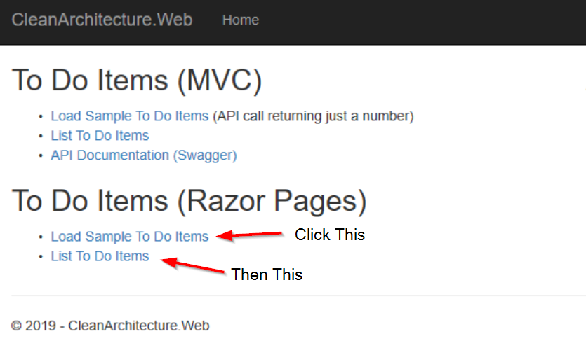

4. You should be able to run the tests in the tests folder, either from the command line or a test runner within your IDE.
5. From command line in the repo root (where the .sln file is), run dotnet test. They should all pass. To run from Visual Studio you will probably need to set the Web project as the startup project.

## Lab 1: The Guest Book Application

Create a domain model consisting of a Guestbook and GuestbookEntry Entities. Display (dummy) entries on the web application’s home page. Expected time to complete: About 30 minutes.

Topics Used

Entities, ViewModels

Requirements

We are building an online guestbook. Anonymous users will be able to view entries on the guestbook, as well as (later) leave messages (GuestbookEntries) on the site. Each GuestbookEntry must include a value for the user’s email address and a message, as well as a DateTimeCreated. For now these won’t have much behavior; we’ll add more later.
The home page should display the most recent ten (10) entries recorded on the guestbook, ordered by when the entry was recorded (most recent first). For now, have the home page just display several hard-coded entries.

Details

Entities

1. Guestbook and GuestbookEntry should inherit from BaseEntity, which defines an integer Id property.
2. Entities should be defined in the Core project, in the Entities folder.
3. Guestbook should include a string Name property.
4. Guestbook should include a List<GuestbookEntry> Entries property.
5. GuestbookEntry should include
    - string EmailAddress
    - string Message
    - DateTimeOffset DateTimeCreated (defaults to Now)

Example:

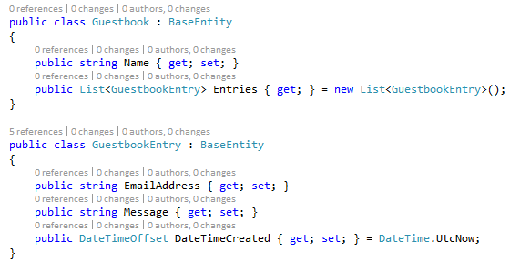

Don’t forget to initialize your collection properties to new Lists to avoid null reference exceptions later.

### UI and ViewModel

6. The Home Page will display the guestbook name and up to 10 entries. Create a HomePageViewModel class in /ViewModels (create this folder) in the Web project. Include these properties:
    a. string GuestbookName
    b. List<GuestbookEntry> PreviousEntries
7. HomeController Index() should create a new Guestbook (Name=”My Guestbook”)
    a. Add several entries to its Entries collection (just hard-code them)
    b. Create a HomePageViewModel from a Guestbook and its entries
    c. Return a View, passing the viewmodel to the View
8. Modify the Views/Home/Index.cshtml view file in the Web project
    a. Specify @model CleanArchitecture.Web.ViewModels.HomePageViewModel at the top of the view file
    b. Display the Guestbook Name at the top of the page
    c. Loop through the Entries and display each entry, most recent first.

    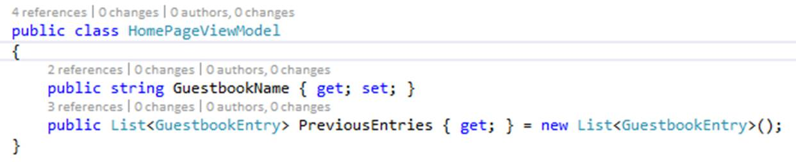

    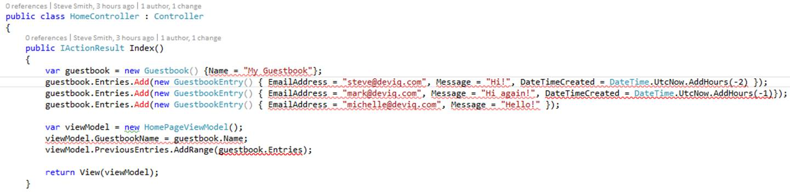

    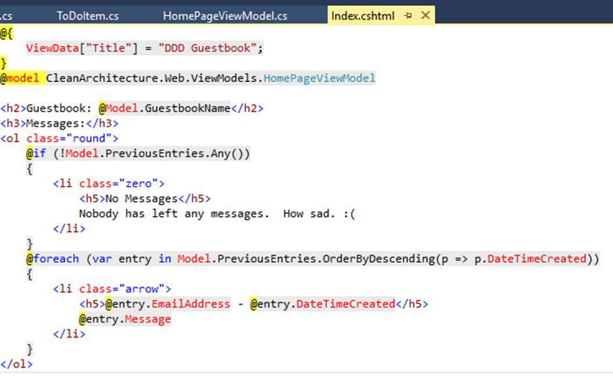
 
Run the app. You should see 3 messages on the home page, most recent at the top.

## Lab 2: Adding Entries to the Guestbook

Goal
Add a form to the page that allows users to add new entries to the Guestbook. Expected time to complete: About 30 minutes.
Topics Used
Repository
Requirements
Display up to 10 of the most recent entries from persistence on the home page. For now, there is only ever one instance of a Guestbook. If none exists in persistence, create one when the home page loads.
Add a form that accepts an EmailAddress and a Message and POSTs to the IndexController. Persist new entries to the Guestbook.
Details
The CleanArchitecture template includes an IRepository and an EfRepository implementation already. You can see an example of it in action in the Web/Controllers/TodoController.cs class. Follow this example to pass an IRepository into HomeController’s constructor and assign it to a private local field.
Determine if there is already a Guestbook in persistence. If not, create and save one in the HomeController’s Index() method, using the repository (you can use the code you have from lab 1 that creates a guestbook with several entries). In any case, fetch the first Guestbook from persistence and use it to populate the HomePageViewModel. Pull the entries with a separate call to the repository for now. In the example below, it’s pulling in all entries from the database, but we’ll correct that behavior later.

Example:

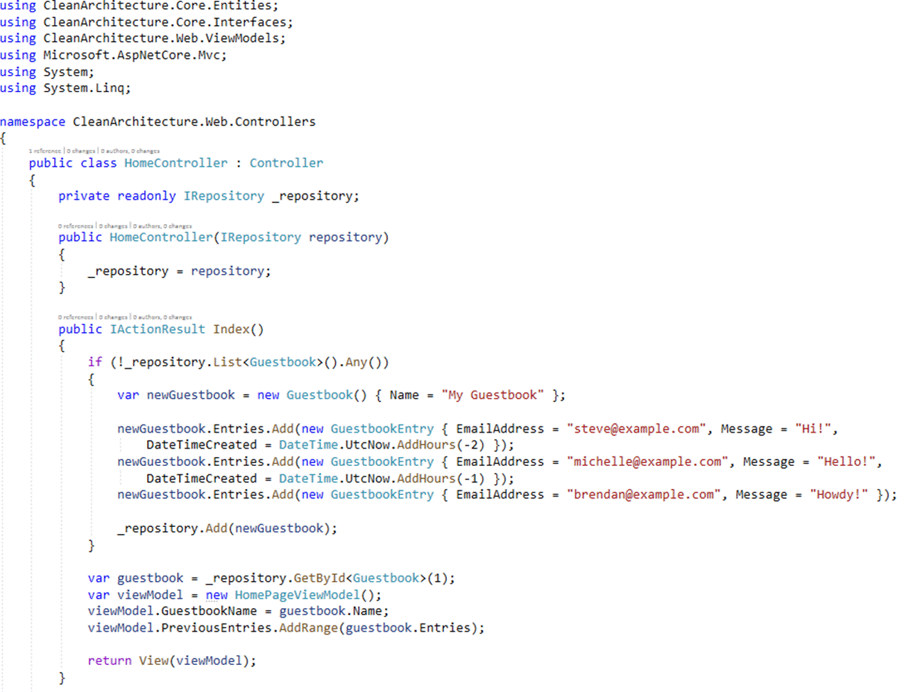
 
Modify AppDbContext to Support Guestbook Entities
The CleanArchitecture template comes with a generic EF repository, but it requires some updates to support Guestbook. Specifically, the dbcontext needs to have a DbSet of Guestbooks and when a Guestbook is fetched, it needs to include the associated Entries collection with it. Add a DbSet<Guestbook> property ‘Guestbooks’ to the Infrastructure/Data/AppDbContext.cs class.
Migrations

We need to use migrations to configure the SqlLite database the application is using. You need to follow these steps in order to set up migrations:
1. Delete the database.sqlite file from the Web project folder.
2. Run this command to create an initial migration from a command prompt in the Web project folder:
dotnet ef migrations add InitialModel --context AppDbContext -p ../CleanArchitecture.Infrastructure/CleanArchitecture.Infrastructure.csproj -s CleanArchitecture.Web.csproj -o Data/Migrations
3. Run this command to apply the migration:
dotnet ef database update -c AppDbContext -p ../CleanArchitecture.Infrastructure/CleanArchitecture.Infrastructure.csproj -s CleanArchitecture.Web.csproj
Note: You may need to install EF Core which may require you configure nuget.org as your default package source.
Including Related Data
One challenge when working with EF Core behind an abstraction like a Repository is how to fetch related data. By default EF Core will only fetch the root object, not related navigation properties. So when we fetch a guestbook it doesn’t include the related Entries. To fix this we will temporarily modify the interface to allow us to pass in the includes we need.
In the Core project, modify the IRepository.cs interface to include this line:

```csharp
T GetById<T>(int id, string include) where T : BaseEntity;
Then in the Infrastructure project, modify EfRepository.cs to include this new method:
public T GetById<T>(int id, string include) where T : BaseEntity
{
    return _dbContext.Set<T>()
        .Include(include)
        .SingleOrDefault(e => e.Id == id);
}
```

Now we just need to tell the repository to include the “Entries” property when we fetch a Guestbook by Id. (We will see a different way to solve this problem in a later lab). In your HomeController.cs, change the line where you fetch the Guestbook to match this one:

```csharp
var guestbook = _repository.GetById<Guestbook>(1, "Entries");
```

At this point you should be able to view the home page and see your test data displayed, which is being stored in persistence (on the first request) and then fetched from persistence (on each request).
Implement Adding Entries
To support adding new entries to the guestbook, you need an HTML form in the view and a new controller action method to handle POSTs.
1. Update /Views/Home/Index.cshtml to include a form above the message list (between the <h2> and <h3> tags). ASP.NET Core tag helpers provide a replacement for HTML Helpers used in previous versions of ASP.NET MVC. 
Example:
(Note: You can copy the Razor/HTML code below from here: http://bit.ly/37cVHcv )

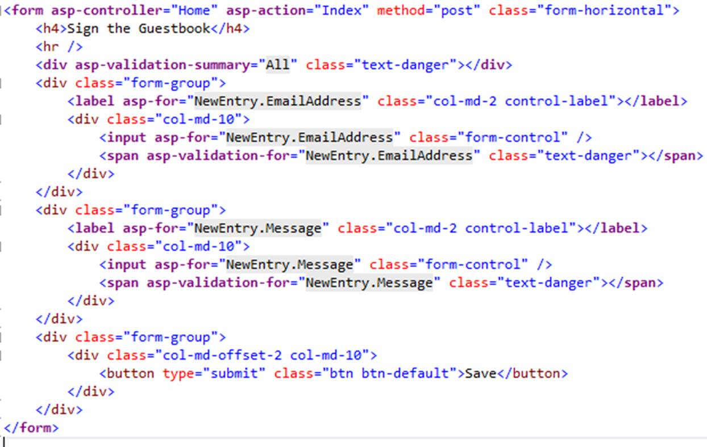
 
Note that the form posts to the Home controller’s Index method, and the two values are EmailAddress and Message from a NewEntry property on the viewmodel.
2. Add a NewEntry property of type GuestbookEntry to the HomePageViewModel.
3. Add a new action method to /Controllers/HomeController.cs: public IActionResult Index(HomePageViewModel model)
a. Add the [HttpPost] attribute to the method
b. Check if ModelState.IsValid. If it is:
i. Fetch the appropriate guestbook (in this case the first one, or ID 1)
ii. Add the NewEntry from the model to the guestbook’s Entries collection.
iii. Update the guestbook using the _repository.
iv. Update the model to reset it and re-add the entries from guestbook
c. Return View(model)

Example:

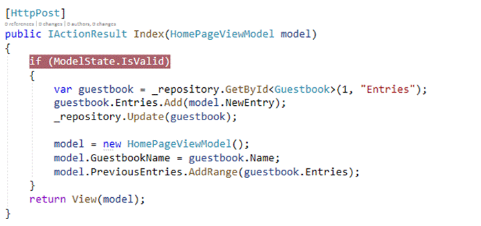
 
Run the application. You should be able to add additional messages to the guestbook, and they should appear at the top of the list.
Note: Since we’re using a real data store, test data will accumulate as you work on these labs. Feel free to delete the database.sqlite file any time you want to reset the data. If you do, you will need to re-run the dotnet ef database update script.
 
Discussion/Review Questions:
1. What do you think about this design so far?
2. Is it following separation of concerns?
3. Is it testable?
4. Is there anything you would refactor to improve it?
5. How is model validation working at this point?
6. Why do you think we have a Guestbook in the model, rather than just Entries?
Reminder: These labs demonstrate how to add functionality in an expedient, but not necessarily well-designed, way, at first. As they continue, you will refactor code from earlier labs to improve upon its design. If you think things aren’t necessarily cleanly designed at this point, I would agree with you (though so far things are very simple so there’s not a huge need for better design).

GitHub Notes – How to Catch Up If You’re Behind
The labs build on one another, but if you fall behind you can jump to a starting point for each lab by using its tag. The easiest way to do this is to clone a new version of the lab from its source, and then jump to the appropriate lab using a tag. Save (and commit, if you’re using git for your own work) you work. Then go to a new folder to clone the sample labs using these commands:
git clone https://github.com/ardalis/ddd-guestbook
git checkout tags/2.1_Lab3Start
Using the above command should result in a solution that has just finished Lab 2 and is ready to begin Lab 3.
You can view a list of available tags using
git tag
If you’re using ASP.NET 3.0, you’ll want to use the tags that are prefixed with 3.0_. Etc. 

## Lab 3: Notifying Users of New Entries

Goal
When a new entry is added to the guestbook, notify anyone who has previously signed the guestbook, but only within the last day. Expected time to complete: 60 minutes.
Topics Used
Domain Events, Services
Requirements
Step 1:
Implement logic in the controller’s POST action to loop through previous entries and send an email to any that have been made within the last day. ASP.NET Core 3.0 supports System.Net.Mail for sending messages via SMTP. If you’re using an earlier version, you can install the “MailKit” Nuget package instead. 
Add the following (non-grey) code just before you add the new entry to guestbook.Entries in your HomeController Post method. You shouldn’t send an email to the person who just signed the guestbook (which is why we’re looping through entities before adding the current message).

```csharp
// notify all previous entries
foreach (var entry in guestbook.Entries)
{
    var message = new MailMessage();
    message.To.Add(new MailAddress(entry.EmailAddress));
    message.From = new MailAddress("donotreply@guestbook.com");
    message.Subject = "New guestbook entry added";
    message.Body =  model.NewEntry.Message ;
    using (var client = new SmtpClient("localhost",25))
    {
        client.Send(message);
    }
}
 
guestbook.Entries.Add(model.NewEntry);
```

Manually test that your solution works, using Smtp4Dev/Papercut or similar.
Consider:
●	What impact does this approach have on testability of the controller?
●	Where in the solution does the business logic for this requirement live?
●	How valuable is the current domain model in representing this logic?
Refactor to use a domain service
Putting this much code in a controller action is a code smell – there’s way too much going on. Let’s move what we can into a service for now as a good incremental step to improve the design.
Step 2: Encapsulate Email Sending in an Infrastructure service.
●	Create an interface to represent sending email (e.g. IMessageSender)
o	Place in Core/Interfaces
o	Keep as simple as possible(e.g. void SendGuestbookNotificationEmail(string toAddress, string messageBody);)
●	Implement the interface in Infrastructure, in a new Services folder (e.g. EmailMessageSenderService : IMessageSender)
 
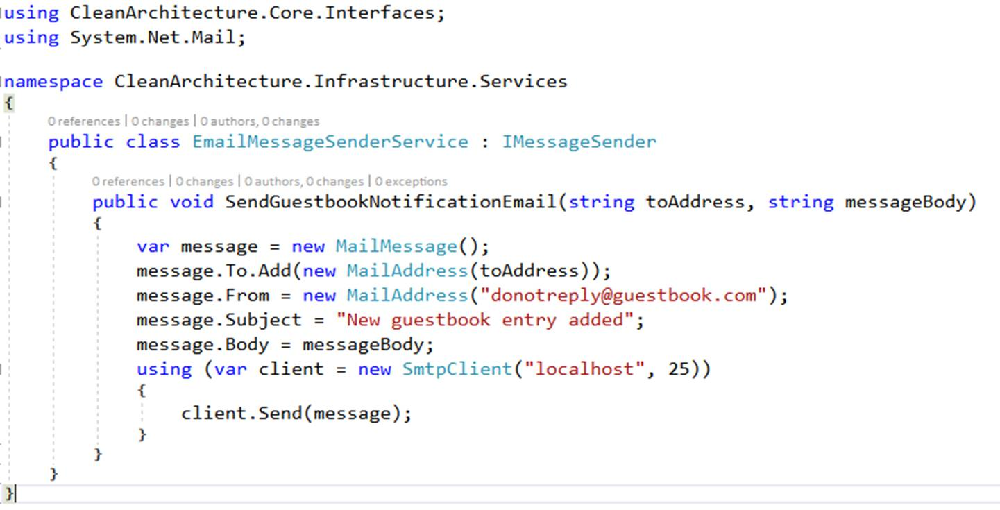

●	Inject IMessageSender into HomeController and re-test your email sending logic

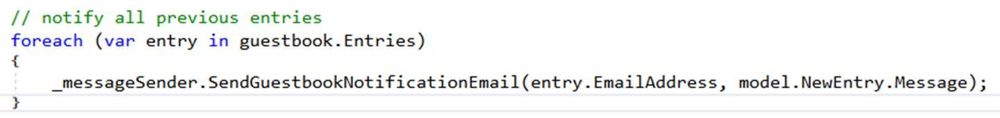
 
Step 3: Encapsulate Sending Notifications

We want to pull the logic of deciding who should get a notification out of the POST action method and into a service in Core. Note, this approach is better than leaving the logic in the UI project, but not ideal because it splits business functionality related to Guestbook into a service, tending to make Guestbook anemic. We’ll shortly see how we can make Guestbook itself more responsible for this behavior.
●	Create an interface IGuestbookService
o	Place in Core/Interfaces
o	Add method void RecordEntry(Guestbook guestbook, GuestbookEntry newEntry);
o	(later you could add additional methods, if desired)
●	Create a new class, GuestbookService, in Core/Services
o	Implement IGuestbookService
o	Inject a repository to access guestbook (IRepository)
o	Inject an IMessageSender to send emails
o	Implement RecordEntry, moving the logic for saving the entry and looping through previous entries from HomeController to this method.
o	Inject an IGuestbookService into HomeController and call its RecordEntry() method inside the POST action.
▪	You should be able to remove IMessageSender from HomeController after this is done.
o	Note: If you named your interface and implementation correctly, StructureMap will map them to one another automatically by convention (so you won’t need to add a line to Startup ConfigureServices).
Test your application again. It should still work as it did before. The controller method should be much smaller now than it was when it was responsible for identifying recipients, building messages, and sending emails
 
 

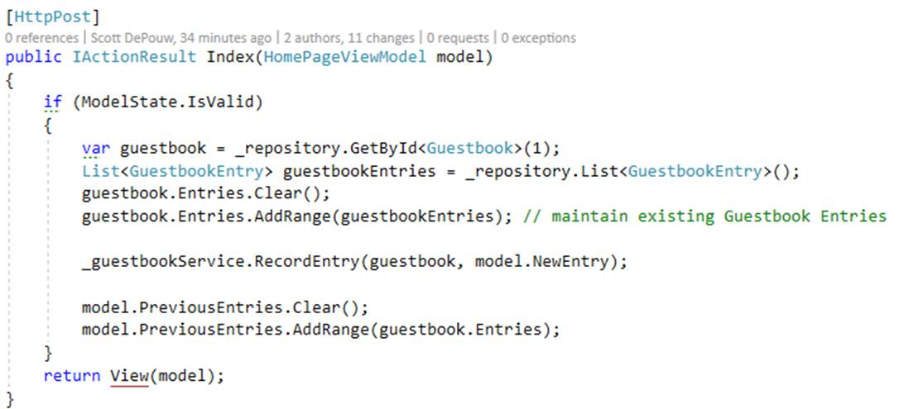 

Step 4: Use a Domain Event
Eliminate the need for a service that only works with one Entity by putting the logic into the Entity itself and raising a domain event to trigger additional behavior. The CleanArchitecture sample project already has built-in support for domain events that are fired when an entity is saved successfully. We just need to add the event and a handler.
●	Create a new domain event in Core/Events called EntryAddedEvent.
●	Inherit from BaseDomainEvent.
●	Include the entry and the guestbook ID in its constructor; expose these as get-only properties.
●	Modify Core/Entities/Guestbook.cs:
o	Add a new public void AddEntry(GuestbookEntry entry) method that adds the entry to Entries.
o	Create a new EntryAddedEvent and add it to the Events collection.
o	(later) Change Entries to make it harder for clients to manipulate it directly – we only want new entries to be added using the AddEntry method.
●	Create a GuestbookNotificationHandler in Core/Handlers
o	Implement IHandle<EntryAddedEvent>
o	Inject IRepository and IMessageSender (just like in GuestbookService)
o	Copy notification logic from GuestbookService to Handle method
o	Realize we missed a requirement! Only send messages to other guestbook signers who signed within the last day.
▪	Also exclude the entry that was added
o	Update HomeController POST method to call Guestbook.AddEntry()
▪	Make sure to call _guestbookRepository.Update(entry) afterward
Test the application again – its behavior should remain unchanged.
 
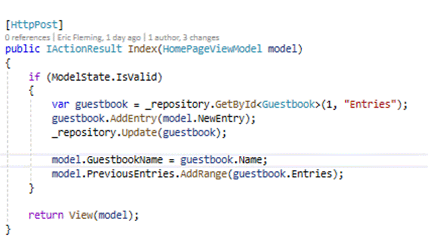 
 
 
In Guestbook:
 
GuestbookNotificationHandler:
 
Note that GuestbookService and its interface can now be deleted. Its existence was tragically cut short by the introduction of the GuestbookNotificationHandler that does the same thing, but automatically whenever an event is raised.
Reference:
https://github.com/ardalis/ddd-guestbook see Tags for different Lab starting points
 
## Lab 4: Testing
Goal
Demonstrate the testability of the solution we've built, and how to test full stack ASP.NET Core MVC apps. Expected time to complete: About 30 minutes.
Topics Used
Testing, xUnit
Requirements
The Guestbook needs to support mobile and/or rich client apps, and thus requires an API. The API needs to support two methods initially:
●	ListEntries: Should list the same entries as the current home page
●	AddEntry: Should add a new entry (just like the form on the current home page)
Detailed Steps
1. Add a new API Controller called GuestbookController to the web project, in the Api folder (/Api/GuestbookController.cs).
a. Use the ToDoItemsController as a reference.
2. Add a method, GetById, that will return a Guestbook or a 404 if the specified id doesn’t exist
Example
// GET: api/Guestbook/1
[HttpGet("{id:int}")]
public IActionResult GetById(int id)
{
	var guestbook = _repository.GetById<Guestbook>(id, "Entries");
	if (guestbook is null)
	{
    	return NotFound(id);
	}
	return Ok(guestbook);
}

3. Add a new integration test class for this GetById in tests/FunctionalTests/Api.
a. Use the ApiToDoItemsControllerListShould class as a reference/starting point.
b. Implement IClassFixture<CustomWebApplicationFactory<Startup>> interface
i. This interface has no methods or properties to implement explicitly. The test class itself simply has to implement it.
c. Inject an instance of CustomWebApplicationFactory<Startup> into the class constructor
d. Initialize a private member variable HttpClient _client with the line _client = factory.CreateClient();
e. Add test data (a sample guestbook with entries) to Web/SeedData.cs in the PopulateTestData method
i. Be sure to use Entries.Add instead of AddEntry to avoid raising events.
ii. Add one Guestbook with one GuestbookEntry.
4. Write a test that confirms the 404 behavior occurs when expected.
5. Write a test that confirms the guest book and its entry are returned correctly when a valid id is supplied.
You should be able to run all of your solution’s tests (should be 12 of them) now, and they should all pass.
Example
 
Add to SeedData:
// add Guestbook test data; specify Guestbook ID for use in tests
var guestbook = new Guestbook() { Name = "Test Guestbook", Id = 1 };
dbContext.Guestbooks.Add(guestbook);
guestbook.Entries.Add(new GuestbookEntry()
{
    EmailAddress = "test@test.com",
    Message = "Test message"
});
dbContext.SaveChanges();

6. Add a new API method to record an entry to a guestbook.
a. Method should take in a guestbook ID and a GuestbookEntry.
b. Method should return 404 if no Guestbook exists for the ID.
c. Return the updated Guestbook if successful.
7. Add a new integration test class for this NewEntry API method (ApiGuestbookControllerNewEntryShould)
8. Write a test to confirm 404 behavior
9. Write a test to confirm entry is created and returned with guestbook correctly
10. Run all of your tests – you should have 14 passing tests.
Example
 
 
Example Tests
 
Extra Credit
Reconfigure your CustomWebApplicationFactory so that it doesn’t replace the domain event dispatcher. Ensure that when you add a new item to your Guestbook, the notification handler sends an email. Now modify the system so that it uses a fake implementation of IMessageSender, so no email is sent (and no test email server needs to be running for tests to pass).
 
## Lab 5: Filters
Goal
Demonstrate how to reduce duplication by pulling out cross-cutting concerns and policies and implementing them as filters. Expected time to complete: About 20 minutes.
Topics Used
MVC Filters
Requirements / Overview
In the previous lab, the API controller you wrote returns 404 whenever the provided ID doesn’t fetch a Guestbook instance. You can imagine that in a real application this kind of behavior will be extremely common and repetitive. It’s important especially for APIs that you be consistent, and it would be easy to have different controllers or actions behave differently, sometimes returning NotFound and other times BadRequest or simply throwing NullReferenceException. Filters can encapsulate policies and can be applied without having to touch implementation code. They can be tested using integration tests as described in the previous lab.
Detailed instructions
1. Add a new VerifyGuestbookExistsAttribute.cs file to Web/Filters.
a. See https://github.com/ardalis/GettingStartedWithFilters for more reference info on filters
2. Have your class inherit from TypeFilterAttribute
3. Create a constructor that chains to the base type: base(typeof(VerifyGuestbookExistsFilter))
4. Create a private nested class VerifyGuestbookExistsFilter
5. Have this class implement IAsyncActionFilter
6. Inject an IRepository into this class.
7. Implement the OnActionExecutionAsync method. Don’t forget to make it async:
 
8. Add an attribute to the API methods that should return a 404 when no guestbook is found.
a. [VerifyGuestbookExists]
b. Optionally you can apply this to the entire Api/GuestbookController class.
9. Remove the if statements that check guestbook for null and return NotFound.
10. Confirm all of your tests still run successfully (especially the ones expecting NotFound).
New in 2.1: [ApiController]
If you apply the [ApiController] attribute to your Controller (or a base controller class), it will automatically include the functionality to check if ModelState is valid.
 
## Lab 6: Specification
Goal
Extract query logic used when sending notifications into a Specification. Expected time to complete: About 30 minutes.
Topics Used
Specification pattern
Requirements / Overview
Pull the filtering logic into its own type where it can be reused and tested.
Detailed Steps
1. Create an ISpecification<T> interface in Core/Interfaces
a. One property on this interface: Expression<Func<T, bool>> Criteria { get; }
b. Extract querying/filtering logic from GuestbookNotificationHandler.cs
i. Put the lambda expression in a new GuestbookNotificationPolicy class in a new Specifications folder in Core.
c. GuestbookNotificationPolicy should implement ISpecification<GuestbookEntry>
d. Implement the Criteria property with the filter lambda expression.
e. Change the List<T> method on the IRepository interface to the following:
i. List<T> List<T>(ISpecification<T> spec = null) where T : BaseEntity;
f. Change the implementation in EfRepository to use the spec’s criteria when available.
 
g. Add unit tests that confirm your criteria works as expected:
i. Create a list of test entries with different dates.
ii. Test that entries from the last day are returned.
iii. Entries older than 24 hours should not be returned.
iv. The entry that triggered the notification should not be returned. You can pass in the id of the triggering entry to your GuestbookNotificationPolicy constructor to achieve this.
h. Update GuestbookNotificationHandler to
i. Create an instance of GuestbookNotificationPolicy in its Handle method (just use new to create it)
ii. Get emailsToNotify by calling 
_repository.List(notificationPolicy).Select(e => e.EmailAddress);
i. Run and test that the application works as before and notifications are sent correctly.
2. Due to a bug in SQLite, we can’t use the DateTimeOffset datatype. This requires us to make a few changes to the code and recreate our Initial Migration
a. If you have not already, make sure to add the GuestbookEntry model to the DbSet.
i. Add public DbSet<GuestbookEntry> GuestbooksEntries { get; set; } to the AppDbContext.cs
b. On the GuestbookEntry model change the DateTimeCreated property to be a DateTime
 
c. In the GuestbookNofificationPolicy, make sure the comparison is between two DateTime datatypes
 
d. Delete the existing database by removing the database.sqlite file
e. Remove the Snapshot and Initial Migration files from the Infrastructure/Migrations folder
f. Rerun the steps in the Migrations section of Lab 2 to create and apply a new initial migration
i. This is required because SQLite also does not support applying migrations.

Example: GuestbookNotificationPolicy

```csharp
public class GuestbookNotificationPolicy : ISpecification<GuestbookEntry>
{
	public GuestbookNotificationPolicy(int entryAddedId = 0)
	{
Criteria = e =>
		e.DateTimeCreated > DateTime.UtcNow.AddDays(-1) // created after 1 day ago
		&& e.Id != entryAddedId; // don't notify the added entry
	}
	
    	public Expression<Func<GuestbookEntry, bool>> Criteria { get; }
}
```

## Lab 7: Encapsulate Collections and Protect Aggregates

Goal

Don't allow client code to directly manipulate entries without going through parent Guestbook entity. Expected time to complete: About 30 minutes.

Topics Used

Aggregate, EF Core

Requirements / Overview

The Guestbook currently exposes a List<GuestbookEntry>. This means client code can be written that will add new entries (without creating associated events), or even clear the entire collection. Encapsulate access to the Guestbook aggregate's child collection by using an IEnumerable property.

Note: Requires EF Core 1.1 or greater.

Detailed Steps

1. Confirm your Infrastructure project is using Microsoft.EntityFrameworkCore (or AspNetCore.All or AspNetCore.App) version 1.1.0 or higher.
2. Modify your Guestbook entity to include a private backing field called _entries of type List<GuestbookEntry>.
    a. Update the Entries property to return an IEnumerable<GuestbookEntry> (instead of List)
    b. Give the Entries property a body for its get method. Return a new ReadOnlyCollection<GuestbookEntry> and provide its constructor with _entries.
    c. Update AddEntry to add to _entries, not Entries.
3. Update AppDbContext (in Infrastructure project) to let EF Core know how to populate the Entries collection.
    a. Add an OnModelCreating override.
    b. Access the Guestbook.Entries navigation property.
    c. Set its PropertyAccessMode to Field.

    Guestbook.cs

    AppDbContext.cs:

4. Update any calls to Add to use AddEntry.
    a. In HomeController.Index and SeedData you can call newGuestbook.Events.Clear() after adding entries to keep events from being raised by SaveChanges.
5. Run your tests – most likely a couple of them are now failing.
6. Set a breakpoint in one of the failing tests where the response is deserialized. Examine the stringResponse.
7. Note there are entries. Now look at the result’s Entries collection:
8. This is because we’ve protected access to the collection – it can no longer be deserialized. Use a DTO instead.
9. Create GuestbookDTO in the ApiModels folder in the Web project.
    a. Expose Id, Entries
10. Create GuestbookEntryDTO in the same folder.
    a. Expose Id, EmailAddress, Message, and DateTimeCreated.
11. Update tests to use these DTOs.
12. Run the tests – they should now pass – but we’re not quite done!
13. Update GuestbookController/HomePageViewModel to return only these DTO types.
14. Update GuestbookController.NewEntry to accept DTO types as input.
15. We still have a test failing, because now that we cannot access a Guestbook’s Entries directly, we can no longer manually clear and add in existing Entries from EntityFramework. As a result, when we fetch Guestbooks from the repository, their respective Entries are missing. To solve this, we need to instruct EntityFramework to Include our Entries whenever we fetch them. Normally, we would expand on our specification concept, and have the Specification classes define what, if anything, should be included. For the purposes of this exercise we will add in a hardcoded hack into EfRepository to do something different if we’re working with Guestbooks.
16. Run all the tests. You should have 100% passing again.

## Reference Links

- [TODO](https://www.microsoft.com)
